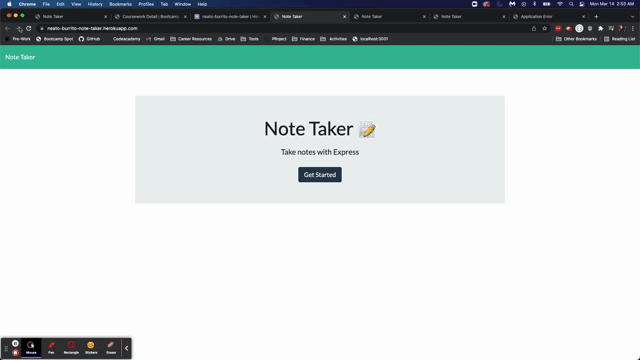

# Neato Burrito Note Taker 

  This is simple note-taking application that can be used to write and save notes. This utilizes Express.js back end and saves/retrieves data from a saved JSON data file. The application also allows the user to delete any accidental or no longer needed notes.  

  # Table of Contents
  * [Installation](#installation)
  * [Usage](#usage)
  * [Contribution Guidelines](#contribution-guidelines)
  * [Tests](#tests)
  * [Questions](#questions)
  * [License](#license)

  ---
  ## Installations
  No installation instructions!

  ## Usage
  This project can be used if you are looking for a very minimalistic way to keep track of basic to-dos or random ideas that come to you throughout your day. 
  
  Take a look at this short video for a walkthrough on how to use the application:

  

  ## Contribution Guidelines
  No

  ## Tests
  No tests for this particular application. 

  ## Questions
  
  If you have any questions or would like to contact me regarding aspects of this project, I can be reached at:
  * GitHub: kvs1995
  * Email: kvswan6408@gmail.com

  ## License: MIT
      This project is licensed under the [MIT License](https://opensource.org/licenses/MIT).

## GitHub and Heroku Information
Heroku Deployment: https://neato-burrito-note-taker.herokuapp.com/notes

GitHub Repository: https://github.com/kvs1995/neato-burrito-note-taker